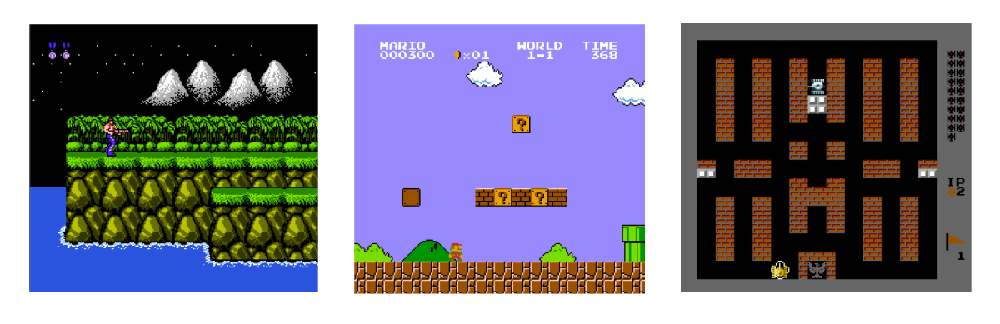

<div align="center">
   
   <p>NES/Famicom emulator with network multiplayer written in Go</p>
   
   
</div>

<hr>

Dendy is a NES/Famicom emulator written in Go and named after the post-soviet Famicom
clone, that I used to have back in my childhood. It’s nothing serious, so do not 
expect it to beat any of the existing emulators in terms of accuracy and compatibility. 
Yet, it is capable of running most of the games I tried, and it comes with a nice 
network multiplayer feature, so it’s not completely useless.



## WebAssembly

The WASM-compiled version for modern browsers is available at 
https://maxpoletaev.github.io/dendy/. It runs surprisingly smooth, though it does 
not support netplay in its current form (there was an [experimental][wasm-netplay] 
implementation of it over WebRTC, but it was too slow and unreliable to be 
usable).

[wasm-netplay]: https://drive.google.com/file/d/1r3ZY20L168u3djRMWA_KLMrY0eIr1ify/view?usp=sharing

## Download

You can download the latest pre-built binaries for Windows, macOS, and Linux
from the releases page: https://github.com/maxpoletaev/dendy/releases (not
guaranteed to work as I don’t have a Windows machine to check it).

Alternatively, if you have Go installed, you either install it using:

```sh
go install "github.com/maxpoletaev/dendy/cmd/dendy@latest"
```

Or clone the repo and build it from source (preferable):

```sh
git clone https://github.com/maxpoletaev/dendy.git
cd dendy
make build
```

For this to work, you may need to install a C compiler (gcc or clang) and additional
dependencies required by raylib. See https://github.com/gen2brain/raylib-go#requirements
for more details.

## Play

There is no GUI, so you will have to run the emulator from the command line.
Just point it to a`.nes` ROM file you want to play:

```sh
dendy romfile.nes
```

There’s a bunch of command line flags that you can learn about by running
`dendy -help`. Here are some of the most useful ones:

 * `-scale=<n>` - Scale the window by `n` times (default: 2)
 * `-nospritelimit` - Disable original sprite per scanline limit (eliminates flickering)
 * `-listen` and `-connect` - For network multiplayer (see below)
 * `-nosave` - Do not load and save the game state on exit
 * `-nocrt` - Disables the CRT effect, in case you don’t like it
 * `-gg` - Apply Game Genie codes (comma-separated)

## Controls

### Controller

Player 1 controller is emulated using the keyboard. The default mapping is as
follows. Multiplayer on a single keyboard is not supported.

```
                   ┆┆
┌───────────────────────────────────────┐
│                                       │
│    [W]                                │
│ [A]   [D]                             │
│    [S]                       [J] [K]  │
│           [Enter] [RShift]            │
│                                       │
└───────────────────────────────────────┘
```

### Zapper (Light Gun)

Zapper is emulated using the mouse and can be used in games like Duck Hunt. Just 
point the mouse cursor at the right position on the screen and click to shoot.

### Hotkeys

 * `CTRL+R` or `⌘+R` - Reset the game
 * `CTRL+Q` or `⌘+Q` - Quit the emulator
 * `CTRL+X` or `⌘+X` - Resync the emulators (netplay)
 * `CTRL+Z` or `⌘+Z` - Undo/Rewind 5 seconds back in time
 * `F12` - Take a screenshot
 * `M` - Mute/unmute

## Game Genie Codes

Game Genie was a cartridge pass-through device that allowed players to modify
the game program ROM data with special codes, creating new effects and cheats.
The code was basically a memory address:value pair that was patched in the
game's memory when that value was read from the cartridge.

You can use various Game Genie codes available on the internet with the emulator 
by passing them as a comma-separated list to the `-gg` flag.

## Network Multiplayer

To utilize the multiplayer feature, you need to start the emulator with the 
`-listen=<host>:<port>` argument on the host machine and the `-connect=<host>:<port>` 
argument on the client machine. Once the connection is established, the game 
will start for both sides. The host machine will be the first player. The players 
must ensure they are running the same ROM file and the same version of the emulator.

```bash
dendy -listen=0.0.0.0:1234 roms/game.nes       # Player 1
dendy -connect=192.168.1.4:1234 roms/game.nes  # Player 2
```

### When players are behind NATs

There is also a way to connect two players behind NATs without having to set up
port forwarding, with a little help from an external relay server. You can use
the `-createroom` flag to create a room on the public server, and the
`-joinroom=<id>` to join it.

Two clients will exchange their public IP addresses and port numbers through the
relay server and establish a peer-to-peer UDP connection using a technique called
"hole punching". The relay server will not be involved in the actual gameplay,
so it should not affect the latency. This method won’t work if both players are
behind symmetric NATs (luckily, most home residential NATs are not symmetric).

```bash
dendy -createroom roms/game.nes            # Player 1 - get a room ID
dendy -joinroom=XXX-XXX-XXX roms/game.nes  # Player 2 - use the room ID
```

I currently host a public relay server, which IP is hardcoded within the emulator.
In case it goes down at some point, you can run your own using the `dendy-relay`
binary (available when building from source), and then set the `-relay` flag in
the emulator to use it.

### Behind the scenes

The multiplayer part works by using something called rollback networking. This 
is a fancy way of making sure that when you play a game with someone else over the 
internet, it feels smooth and quick, just like playing side by side.

Here’s how it works: the game runs full speed for both players, and every move 
you make is sent over the internet to the other player. The cool part is, the 
local player should not notice any delay when they press buttons because the game 
guesses what the other player is going to do before their moves actually get to you.
If the guess is wrong, the game quickly fixes it by going back a tiny bit to when 
both players agreed on what was happening, then moves forward again using the 
correct moves.

In addition to predicting and correcting player actions, it has a mechanism to 
ensure frame rate synchronization between players, especially when there are 
drifts in clock speed causing one player’s game running slower than the other’s. 
The emulator can detect that one of the players is falling behind too much and
adjust the frame rate accordingly or even pause the game for one player for a 
few frames to let the other player catch up.

Within a reasonable latency, all of this should happen in a fraction of a second,
without the players noticing anything weird. When tested, ping of up to 150ms 
felt pretty playable.

## Tested Games

| Game | Status | Issues |
|------|--------|--------|
| [Bad Apple][badapple] | Playable ||
| Balloon Fight | Playable ||
| Batman| Playable ||
| Battle City | Playable ||
| Battletoads | Playable ||
| Battletoads & Double Dragon | Not Playable | Freezes |
| Bomberman | Playable ||
| Bomberman 2 | Playable ||
| Captain America | Playable ||
| Castlevania | Playable ||
| Chip 'n Dale | Playable ||
| Chip 'n Dale 2 | Playable ||
| Contra Force | Playable ||
| Contra | Playable ||
| Darkwing Duck | Playable ||
| Dr. Mario | Playable ||
| Donkey Kong | Playable ||
| Double Dragon 2 | Playable ||
| Double Dragon 3 | Playable ||
| Duck Hunt | Playable ||
| Duck Tales | Playable ||
| Ice Climber | Playable ||
| Jackal | Not Playable | Black screen |
| Kirby's Adventure | Playable ||
| Legend of Zelda | Playable ||
| Mario Bros. | Playable ||
| Megaman | Playable ||
| Megaman 4 | Playable ||
| Metal Gear | Playable ||
| Mighty Final Fight | Playable ||
| Ninja Cat | Playable ||
| Prince of Persia | Playable | Incorrect sprite/background priority |
| Super Contra | Playable ||
| Super Mario Bros. 3 | Crash ||
| Super Mario Bros. | Playable ||
| Teenage Mutant Ninja Turtles | Playable ||
| Teenage Mutant Ninja Turtles 2 | Playable ||
| Teenage Mutant Ninja Turtles 3 | Playable ||
| Teenage Mutant Ninja Turtles: Tournament Fighters | Not Playable | Graphical artifacts |
| Tiny Toon Adventures | Playable ||

[badapple]: https://www.nesdev.org/wiki/Bad_Apple

## Status

### CPU

* [x] Official opcodes
* [x] Unofficial opcodes
* [x] Runtime disassembly
* [x] Cycle-accurate emulation
* [x] Accurate clock speed
* [x] Interrupts

### Graphics

* [x] Background rendering
* [x] Sprite rendering
* [x] 8×16 sprites
* [x] Palettes
* [x] Scrolling

### Input/Output

* [x] Graphics output
* [x] Controllers
* [x] Zapper

### Sound

The sound chip emulation is still work in progress and is not very reliable yet.
It may occasionally produce some pops and crackles, but it should be good enough
for most games.

* [x] Square channels
* [x] Triangle channel
* [x] Noise channel
* [x] Length counter
* [x] Envelope
* [x] Sweep
* [x] DMC

### Mappers

The goal is to support top 7 mappers covering the majority of games. The
percentage indicates the number of games that use the mapper according to
nescartdb.com.

* [x] MMC1 (Mapper 1) - 28%
* [x] MMC3 (Mapper 4) - 24%
* [x] UxROM (Mapper 2) - 11%
* [x] NROM (Mapper 0) - 10%
* [x] CNROM (Mapper 3) - 6%
* [x] AxROM (Mapper 7) - 3%
* [ ] MMC5 (Mapper 5) - 1%

## Dependencies

 * https://github.com/gen2brain/raylib-go/raylib - Go bindings for Raylib (graphics/audio)
 * https://github.com/xtaci/kcp-go - TCP-over-UDP for netplay

## Resources

* [NESDev Wiki](https://www.nesdev.org/wiki/Nesdev_Wiki)
* [MOS 6502 CPU Reference](https://web.archive.org/web/20210429110213/http://obelisk.me.uk/6502/) by Andrew Jabobs
* [Extra Instructions of the 65xx Series CPU](http://www.ffd2.com/fridge/docs/6502-NMOS.extra.opcodes) by Adam Vardy
* [NES Rendering Overview](https://austinmorlan.com/posts/nes_rendering_overview/) by Austin Morlan
* [Making NES Games in Assembly](https://famicom.party/book/) by Kevin Zurawel
* [NES Emulator from Scratch](https://www.youtube.com/playlist?list=PLrOv9FMX8xJHqMvSGB_9G9nZZ_4IgteYf) series by javidx9
* [Audio pseudo-code](https://forums.nesdev.org/viewtopic.php?t=13767) by oRBIT2002
* [Retroarch Netplay README](https://github.com/libretro/RetroArch/blob/master/network/netplay/README)
* [GameGenie Technical Notes](https://tuxnes.sourceforge.net/gamegenie.html)

## Referenced Projects

* [github.com/OneLoneCoder/olcNES](https://github.com/OneLoneCoder/olcNES)
* [github.com/ad-sho-loko/goones](https://github.com/ad-sho-loko/goones)
* [github.com/fogleman/nes](https://github.com/fogleman/nes)
* [github.com/marethyu/nesty](https://github.com/marethyu/nesty)
